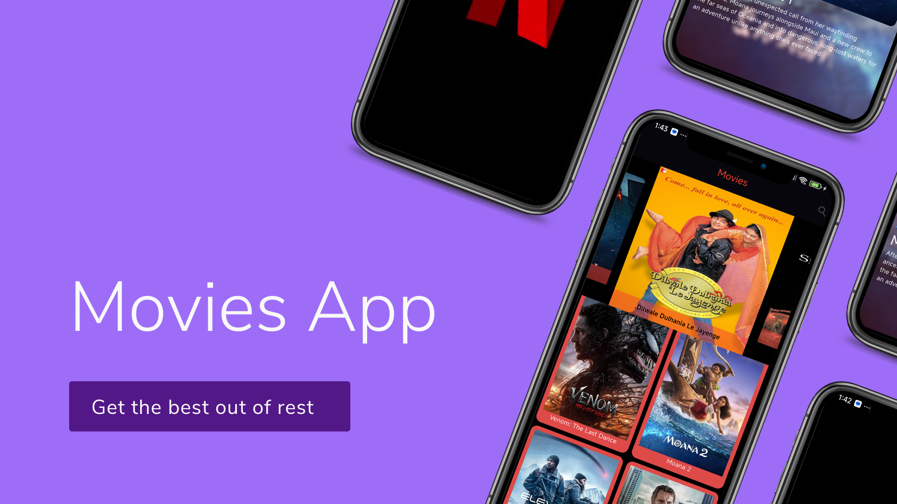
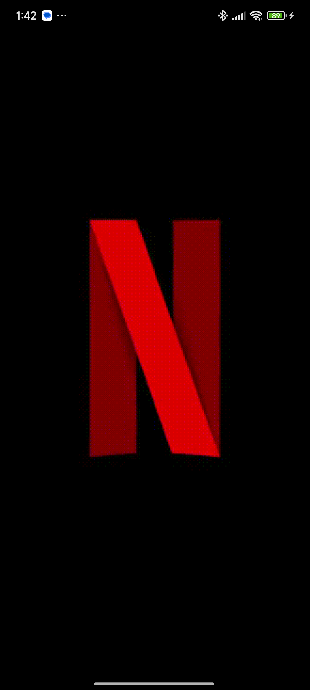

# Movies App

## Overview
The **Movies App** is a Flutter-based mobile application designed for movie enthusiasts. It demonstrates advanced development techniques such as **state management**, integration with **RESTful APIs**, and the use of **animations** to enhance the user experience. The app leverages Flutter widgets for a dynamic and responsive UI.

---

## Features
- **Movie Listings**
  - Fetches and displays movies in grid or list views.
  - Provides detailed information for each movie (title, rating, synopsis, etc.).
  
- **State Management**
  - Implements efficient state management for seamless interaction and data handling.
  
- **RESTful APIs**
  - Integrates with APIs to fetch real-time data for trending, upcoming, and top-rated movies.
  
- **Animations**
  - Includes smooth animations for transitions and interactions.
  
- **Dynamic Widgets**
  - Utilizes a wide range of Flutter widgets to create a visually appealing UI.

---


## Installation
1. Clone the repository:
   ```bash
   git clone https://github.com/your-username/movies-app.git
   cd movies-app
2. Install dependencies::
   ```bash
   flutter pub get
3. Run the app:
   ```bash
   flutter run
## ScreenShots


## App Previews

|  |  |  |
|--------------------------------------------------------|--------------------------------------------------------|--------------------------------------------------------|
|                     Splash Screen                      |                        Home Screen                     |                           Movie Screen                 |

